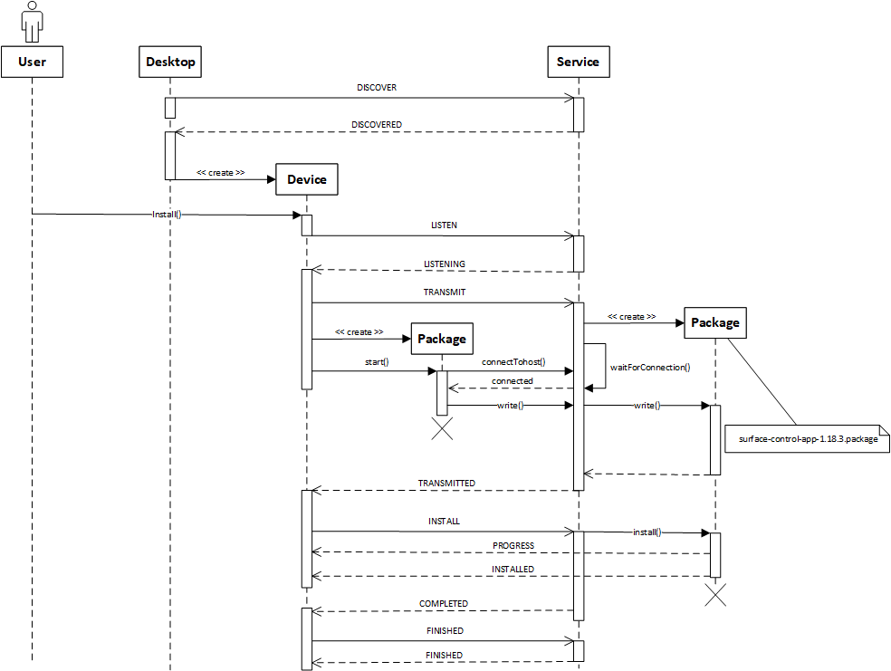

# Introduction

The surfaceCONTRoL Maintenance Suite splits into a Desktop-App and a Service-App.
- The Desktop-App is commonly used by End-Users to maintain the Sensor device(s) and acts as a Communiation-Endpoint
- The Service-App is integrated in the sensor firmware and acts as the other Communication-Endpoint

Both the Desktop-App and the Service-App communicates over the [Device Maintenance Control Protocol](dmpc.md). In this Introduction, we will talk about the Communication Flow and how a maintenance task is done.

### Communication

